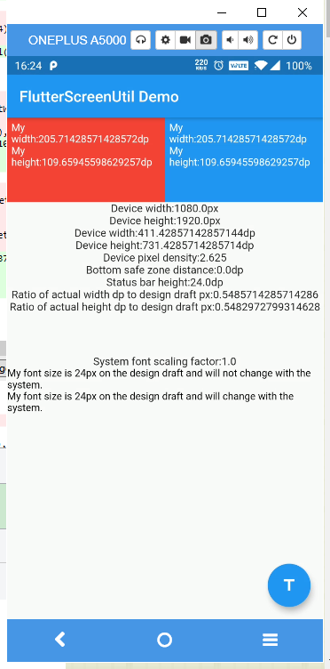

# flutter_ScreenUtil
**A flutter plugin for adapting screen and font size.Let your UI display a reasonable layout on different screen sizes!**

[中文文档](https://github.com/OpenFlutter/flutter_ScreenUtil/blob/master/README_CN.md)

github: https://github.com/OpenFlutter/flutter_ScreenUtil


## Usage:

### Add dependency：
Please check the latest version before installation.
```
dependencies:
  flutter:
    sdk: flutter
  # add flutter_ScreenUtil
  flutter_screenutil: ^0.3.1
```

### Add the following imports to your Dart code:
```
import 'package:flutter_screenutil/flutter_screenutil.dart';
```

### Initialize the setup size
Please set the width and height of the design draft before use, the width and height of the design draft (unit px).
Be sure to set the page in the MaterialApp's home to ensure that the fit size is set before each use:

```
//Set the fit size (fill in the screen size of the device in the design)
//If the design is based on the size of the iPhone6 ​​(iPhone6 ​​750*1334)
ScreenUtil.instance = ScreenUtil(width: 750, height: 1334)..init(context);
```

### Use：

Adapt screen size：
```
Pass the px size of the design draft：

Width after adaptation: ScreenUtil().setWidth(540),
Height after adaptation: ScreenUtil().setHeight(200),

//for example:
Container(
           width: ScreenUtil().setWidth(375),
           height: ScreenUtil().setHeight(200),
           ...
            ),
```

Adapter font:
``` 
      ScreenUtil().setSp(28)         //Incoming font size，the unit is pixel, fonts will scale to respect Text Size accessibility settings
      ScreenUtil().setSp(28，false)  //Incoming font size，the unit is pixel，fonts will not scale to respect Text Size accessibility settings

for example:
        Text(
             'My font size is 28px and will not change with the system.',
                 style: TextStyle(
                   color: Colors.black,
                   fontSize: ScreenUtil().setSp(28, false) 
                 )
             ),

```

Other related apis：
```
    ScreenUtil.pixelRatio       //Device pixel density
    ScreenUtil.screenWidth      //Device width
    ScreenUtil.screenHeight     //Device height
    ScreenUtil.bottomBarHeight  //Bottom safe zone distance, suitable for buttons with full screen
    ScreenUtil.statusBarHeight  //Status bar height , Notch will be higher Unit px
    ScreenUtil.textScaleFactory //System font scaling factor

    ScreenUtil().scaleWidth //The ratio of font and width to the size of the design
    ScreenUtil().scaleHeight //The ratio of  height width to the size of the design

```

```
//import
import 'package:flutter_screenutil/flutter_screenutil.dart';

...

  @override
  Widget build(BuildContext context) {
    ///Set the fit size (fill in the screen size of the device in the design) If the design is based on the size of the iPhone6 ​​(iPhone6 ​​750*1334)
    ScreenUtil.instance = ScreenUtil(width: 750, height: 1334)..init(context);
    print('Device width:${ScreenUtil.screenWidth}'); //Device width
    print('Device height:${ScreenUtil.screenHeight}'); //Device height
    print(
        'Device pixel density:${ScreenUtil.pixelRatio}'); //Device pixel density
    print(
        'Bottom safe zone distance:${ScreenUtil.bottomBarHeight}'); //Bottom safe zone distance，suitable for buttons with full screen
    print(
        'Status bar height:${ScreenUtil.statusBarHeight}px'); //Status bar height , Notch will be higher Unit px
    print(
        'The ratio of font and width to the size of the design:${ScreenUtil().scaleWidth}'); //The width is enlarged relative to the design draft
    print(
        'The ratio of  height width to the size of the design:${ScreenUtil().scaleHeight}'); //The height is enlarged relative to the design draft

    return new Scaffold(
      appBar: new AppBar(
        title: new Text(widget.title),
      ),
      body: new Center(
        child: Column(
          crossAxisAlignment: CrossAxisAlignment.center,
          children: <Widget>[
            Row(
              children: <Widget>[
                Container(
                  width: ScreenUtil().setWidth(375),
                  height: ScreenUtil().setHeight(200),
                  color: Colors.red,
                  child: Text(
                    'My width:${ScreenUtil().setWidth(375)}dp',
                    style: TextStyle(
                        color: Colors.white,
                        fontSize: ScreenUtil().setSp(28, false)),
                  ),
                ),
                Container(
                  width: ScreenUtil().setWidth(375),
                  height: ScreenUtil().setHeight(200),
                  color: Colors.blue,
                  child: Text('My width:${ScreenUtil().setWidth(375)}dp',
                      style: TextStyle(
                          color: Colors.white,
                          fontSize: ScreenUtil().setSp(28, false))),
                ),
              ],
            ),
            Text('Device width：${ScreenUtil.screenWidth}px'),
            Text('Device height:${ScreenUtil.screenHeight}px'),
            Text('Device pixel density:${ScreenUtil.pixelRatio}'),
            Text('Bottom safe zone distance:${ScreenUtil.bottomBarHeight}px'),
            Text('Status bar height:${ScreenUtil.statusBarHeight}px'),
            Text(
              'The ratio of font and width to the size of the design:${ScreenUtil().scaleWidth}',
              textAlign: TextAlign.center,
            ),
            Text(
              'The ratio of  height width to the size of the design:${ScreenUtil().scaleHeight}',
              textAlign: TextAlign.center,
            ),
            SizedBox(
              height: ScreenUtil().setHeight(200),
            ),
            Text('System font scaling factor:${ScreenUtil.textScaleFactory}'),
            Column(
              crossAxisAlignment: CrossAxisAlignment.start,
              children: <Widget>[
                Text(
                    'My font size is 28px and will not change with the system.',
                    style: TextStyle(
                        color: Colors.black,
                        fontSize: ScreenUtil().setSp(28, false))),
                Text('My font size is 28px and will change with the system.',
                    style: TextStyle(
                        color: Colors.black, fontSize: ScreenUtil().setSp(28))),
              ],
            )
          ],
        ),
      ),
    );
  }
```

### example:

[example demo](/example/lib/main_zh.dart)
 
effect:



